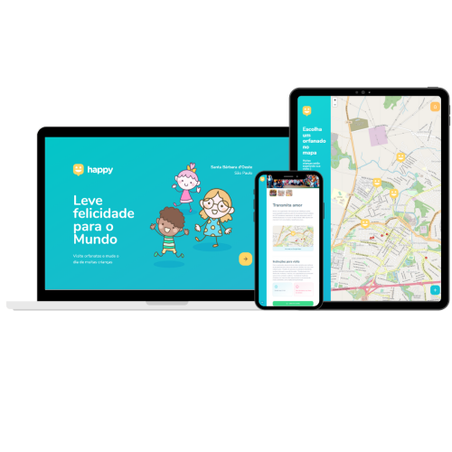
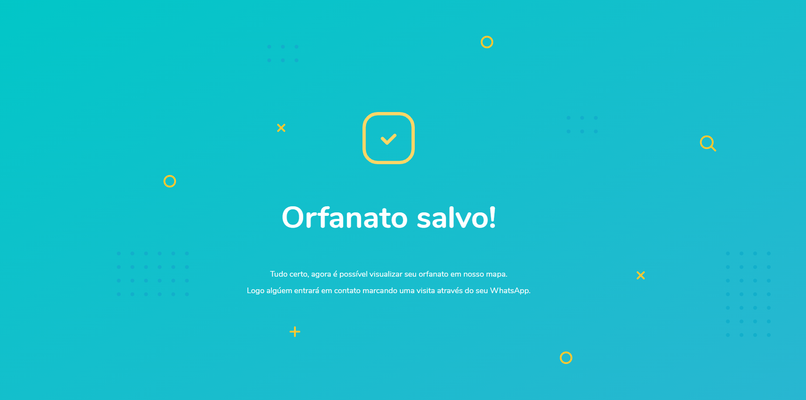
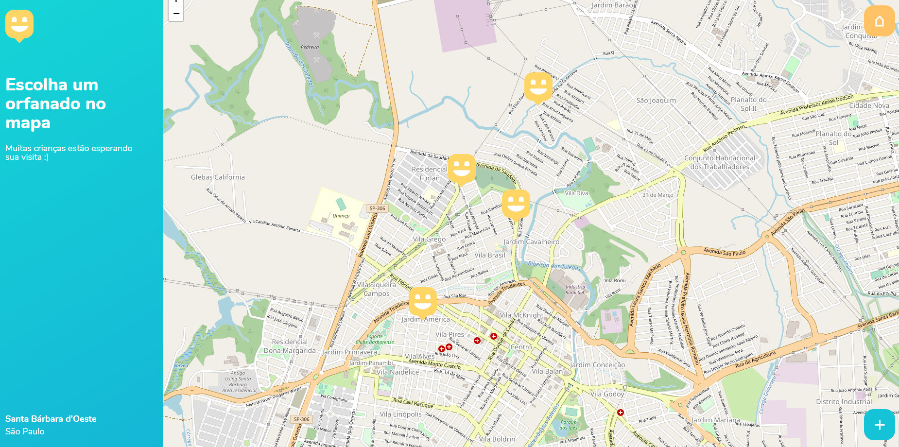
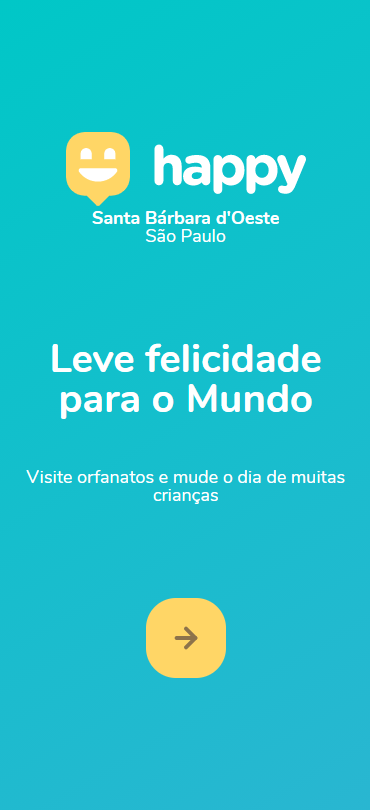
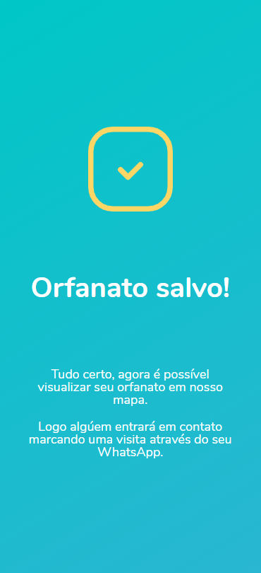
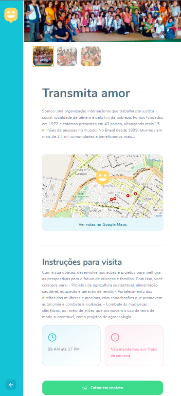

<p align="center">
  
</p>

<p align="center">
  
</p>

<p align="center">	
  

  <a href="https://github.com/edward-mn/happy-nlw/commits/master">
    
  </a> 
  
  
  
  <a href="https://github.com/edward-mn/happy-nlw/stargazers">
    
  </a>
  
  
  
     
</p>

<strong>
  <p align="center">
    <a href="#-about">About</a> |
    <a href="#-layout">Layout</a> |
    <a href="#-functionalities">Functionalities</a> |
    <a href="#-my-next-level">My Next Level</a> | 
    <a href="#-technologies">Technologies</a> |
    <a href="#-how-to-download-and-run">How to download and run</a> | 
    <a href="#-important-links">Important links</a> | 
    <a href="#-author">Author</a> | 
    <a href="#-show-your-support">Suport</a>
  </p>
</strong>

## 💁 About
Happy is an application responsible for bringing happiness to children or young people in need.

Because your main idea is to be an orphanage collector, that is, the more registered orphanages, the greater our variety in transmitting happiness and love to those who need it most.

Now doing good has become even easier and more practical 😁!

---

## 🎨 Layout

### 🖥 view

<p align="center">
  
  
  
</p>

### 📱 view

<center>
<table>
  <tr>
      <td></td>
      <td></td>
      <td></td>
  </tr>  
</table>
</center>

---

## 🖥 Functionalities

:round_pushpin: Localize nearby Orphanages:
- The app will show for you the nearby it and you could open with Google Maps, to that creates your route of :smile: to the nearest Orphanage.

:new: Create new Orphanages
- You could register new Orphanages and fill every information to others know more about it.

:information_source: Info about the Orphanages
- You could know everything about the Orphanages and How you must prepare yourself to make an awesome visit.

---

## 🆙 My Next Level

:heavy_check_mark: Save page and Redirect - [Issue](https://github.com/edward-mn/happy-nlw/issues/15)
- Created a **new page** to show that Orphanage was saved and **redirect** to Orphanages page.

⚠ Change de alert to X0popup - [Issue](https://github.com/edward-mn/happy-nlw/issues/12)
- Used x0popup to show for user that **has not marked** an orpahange at map

🗺 Show the current location (City and State) on app - [Issue](https://github.com/edward-mn/happy-nlw/issues/11)
- Used [Geolocation](https://developers.google.com/maps/documentation/javascript/examples/map-geolocation) to get a **City** and **State** current through of [Nominatim 🌍](https://github.com/osm-search/Nominatim)
- If the user **block** the location, by default the city and state, will be the same as the course (Rio do Sul - Santa Catarina)

🏠 Navigation to home easier - [Issue](https://github.com/edward-mn/happy-nlw/issues/9)
- Add an **icon home** for go to the index

👀 Quantity of characters is allowed - [Issue](https://github.com/edward-mn/happy-nlw/issues/7)
- Show at run time the quantity of **characters is allowed**, when filling in the field **About**

📌 Marker in selected fields - [Issue](https://github.com/edward-mn/happy-nlw/issues/3)
- Show a **marker when we select fields**

♻ Refactoring - [Issue](https://github.com/edward-mn/happy-nlw/issues/2)
- **Remove the back-end's responsibility** to validate the fields (Lat and Lng) at 🌎

☎️ Formate Whatsapp - [Issue](https://github.com/edward-mn/happy-nlw/issues/1)
- Add a **formater** at Whatsapp field to looks better

---

## 🛠 Technologies 
- [HTML5](https://pt.wikipedia.org/wiki/HTML5)
- [CSS3](https://pt.wikipedia.org/wiki/CSS3)
- [Java Script](https://www.javascript.com/)
- [Banco de 🎲 (Sqlite)](https://www.sqlite.org/index.html)
- [Leaflet 🍃](https://leafletjs.com/)
- [Handlebars 🧔](https://github.com/handlebars-lang/handlebars.js)
- [Nodemon](https://github.com/remy/nodemon)
- [Express](https://github.com/expressjs/express)
- [Cleave ☎](https://github.com/nosir/cleave.js)
- [x0popup ⚠](https://github.com/gao-sun/x0popup)
- [Nominatim 🌍](https://github.com/osm-search/Nominatim)

---

## 📦 How to [download](https://github.com/edward-mn/happy-nlw/archive/master.zip) and run
```bash
# Clone's reposity
$ git clone git@github.com:edward-mn/happy-nlw.git

# Acess the folder project into your vscode
$ cd happy-nlw

# Install the dependencies
$ npm install

# Execute run the app 
$ npm start

# The server will start in port:5500 - acess http://localhost:5500
```
---

## 🔗 Important links

- Exchange ideas with the communities: [Discord](https://discord.com/invite/as33qEE)
- Want to participate: [Event](https://nextlevelweek.com/inscricao/3)

> Project developed during the **NLW - Next Level Week#03** offered by [Rocketseat🚀](https://rocketseat.com.br/)

<p align="center">
  
</p>

---

## 🦹‍ Author

* **Edward Moreira**
* :octocat: [@edward-mn](https://github.com/edward-mn)
* <a href="https://www.linkedin.com/in/edward-moreira-5b3056115/">
    
  </a> 
* :rocket: [Edward Moreira](https://app.rocketseat.com.br/me/edward-moreira-do-nascimento-02578)

---

## 🤝 Show your support

Give a ⭐️ if this project helped you or liked!

***

<strong>
  <p align="center"> This README was created with ❤️ by me </p>
</strong>
